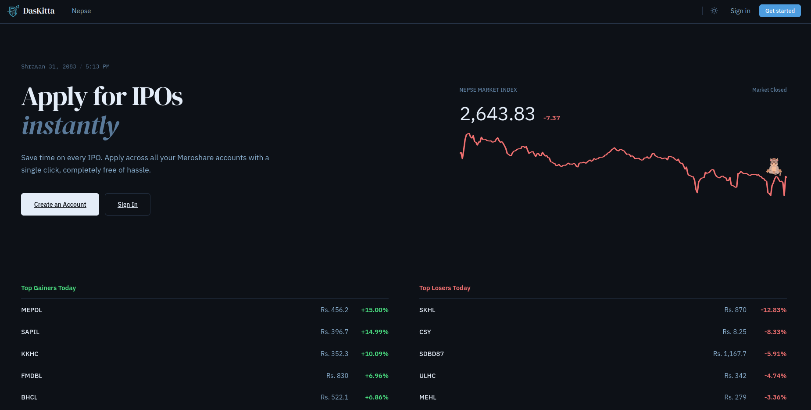

# DasKitta

A unified investment management platform for NEPSE investors. Manage multiple Meroshare accounts, apply for IPOs in bulk, track portfolio holdings, and monitor real-time market activity—all from a single application.

**Live Application:** [https://daskitta.vercel.app](https://daskitta.vercel.app)


## Recent Improvements

Latest enhancements and optimizations:

- **Caching & Rate Limiting:** Integrated Upstash Redis with WebFlux support for optimized performance and API rate limiting
- **Email Service:** Replaced in-built email service with custom email micorservice API for reliable email delivery
- **Account Management:** Added delete account feature and credential update capabilities
- **Data Enhancements:** Track Meroshare and DEMAT account expiry dates; view detailed Meroshare account information
- **Error Handling:** Comprehensive error handling improvements and code optimizations
- **Configuration:** Environment-based configuration with dotenv support for local development
- **Docker:** Optimized multi-stage Docker builds with proper permission handling for Tomcat
- **Legal Compliance:** Integrated Terms of Service, Privacy Policy, and Disclaimer pages

## Core Features

### Authentication and User Profile
- JWT-based authentication with secure token management
- Registration, login, and OTP verification with resend capability
- Profile management: password, username, and email change workflows
- Protected routes with automatic redirection for unauthorized access

### Multi-Account Management
- Manage multiple Meroshare accounts under a single DasKitta user
- Fetch DP and bank listings dynamically
- Update account credentials without re-adding accounts
- View aggregated portfolio and per-account information

### IPO and Investment Tools
- Discover and track open IPO opportunities
- Apply to multiple IPOs across selected accounts simultaneously
- Check IPO results by share ID (guest access available)
- Access application history and CDSC summary data

### Market Intelligence
- Real-time NEPSE market data and live market feed
- Market indices, sub-indices, and sector performance
- Top performers: gainers, losers, turnover, and transaction data
- Company profiles with price history, market depth, and floorsheet data

### Progressive Web App (PWA)
- Install as a native app on supported browsers
- Auto-updating service worker for seamless updates
- Offline support and improved performance

## Tech Stack

| Component | Technology |
|-----------|-----------|
| **Frontend** | React 19, React Router 7, Vite 8, Axios, Framer Motion, Recharts |
| **Backend** | Java 21, Spring Boot 3.5.14, Spring Security, Spring Data JPA, Spring WebFlux |
| **Database** | PostgreSQL 14+ |
| **Security** | JWT (jjwt 0.12.5), AES encryption for sensitive credentials |
| **PWA** | vite-plugin-pwa |
| **Containerization** | Docker (multi-stage builds), Docker Compose

## Project Structure

```
DasKitta/
├── backend/
│   ├── src/main/java/com/meroshare/backend/
│   │   ├── controller/           API endpoints (Auth, Account, IPO, NEPSE, Ping)
│   │   ├── service/              Business logic and external API integration
│   │   ├── security/             JWT filters, token utilities, encryption
│   │   ├── repository/           Spring Data JPA repositories
│   │   ├── entity/               JPA domain models
│   │   └── dto/                  Request and response data transfer objects
│   ├── src/main/resources/
│   │   └── application.properties
│   ├── pom.xml
│   ├── Dockerfile                Multi-stage Java 21 build
│   └── mvnw                       Maven wrapper for consistent builds
│
├── frontend/
│   ├── src/
│   │   ├── api/                  API client modules (auth, accounts, ipo, nepse)
│   │   ├── components/           Reusable UI components and route guards
│   │   ├── context/              State management (Auth, Account, Notification, Theme)
│   │   ├── pages/                Page components (Home, Dashboard, IPO, NEPSE, etc.)
│   │   └── assets/               Images and static resources
│   ├── package.json
│   ├── vite.config.js
│   ├── eslint.config.js
│   ├── index.html
│   └── vercel.json               Vercel deployment configuration
│
├── docker-compose.yml            PostgreSQL service for local development
├── README.md                      This file
├── MEROSHARE_API_REFERENCE.md     Meroshare API documentation
└── NEPSE_API_REFERENCE.md         NEPSE API documentation
```

## API Reference

Base URL: `http://localhost:8080/api` (local) 

### Authentication Endpoints
```
POST   /auth/register              Register a new user
POST   /auth/login                 Authenticate and receive JWT
POST   /auth/verify-otp            Verify OTP for login
POST   /auth/resend-otp            Request OTP resend
PATCH  /auth/password              Change password
PATCH  /auth/username              Change username
POST   /auth/email/request-change  Initiate email change
POST   /auth/email/confirm-change  Confirm email change
GET    /auth/me                    Get authenticated user profile
```

### Account Management Endpoints
```
GET    /accounts                   List all user accounts
POST   /accounts                   Add new Meroshare account
PATCH  /accounts/{id}              Update account credentials
DELETE /accounts/{id}              Remove account
GET    /accounts/{id}/info         Get account information
GET    /accounts/{id}/portfolio    Get account portfolio
GET    /accounts/dp-list           List all DPs
GET    /accounts/bank-by-dp/{dpId} List banks for a DP
```

### IPO Endpoints
```
GET    /ipo/open                   List open IPO opportunities
GET    /ipo/applied-companies      Get applied companies
GET    /ipo/shares                 Get public share list
POST   /ipo/apply                  Apply to IPOs
GET    /ipo/result/{shareId}       Check IPO result
GET    /ipo/history                Get application history
GET    /ipo/cdsc-summary           Get CDSC summary data
```

### Market Data Endpoints
```
GET    /nepse/live-market          Real-time market data
GET    /nepse/index                Market indices
GET    /nepse/sub-indices          Sub-indices data
GET    /nepse/summary              Market summary
GET    /nepse/is-open              Check market status
GET    /nepse/top-gainers          Top gaining stocks
GET    /nepse/top-losers           Top losing stocks
GET    /nepse/top-turnover         Highest turnover stocks
GET    /nepse/top-trade            Top traded stocks
GET    /nepse/top-transaction      Top transaction stocks
GET    /nepse/supply-demand        Supply and demand data
GET    /nepse/companies            List all companies
GET    /nepse/company/details      Company profile
GET    /nepse/price-volume         Price and volume data
GET    /nepse/price-volume-history Historical price data
GET    /nepse/market-depth         Market depth for symbol
GET    /nepse/scrip-price-graph    Price graph for symbol
GET    /nepse/floorsheet           Floorsheet data
GET    /nepse/floorsheet/company   Company floorsheet
```

**Note:** Detailed API request/response documentation is available in internal reference files. Contact the developer for access to the Meroshare and NEPSE API reference documentation.

## Getting Started

### Prerequisites

- **Java 21+** (for backend development)
- **Node.js 20+** and npm (for frontend development)
- **PostgreSQL 14+** (database)
- **Docker & Docker Compose** (optional, for containerized setup)
- **Maven Wrapper** (included in backend directory)

### Step 1: Database Setup

**Option A: Local PostgreSQL**
```bash
createdb daskitta_db
```

**Option B: Docker Compose** (recommended)
```bash
docker compose up -d
```

### Step 2: Backend Configuration

1. Navigate to the backend directory:
```bash
cd backend
```

2. Set required environment variables:
```bash
export PORT=8080
export DATABASE_URL='jdbc:postgresql://localhost:5432/daskitta_db'
export DB_USERNAME='postgres'
export DB_PASSWORD='your_password'

export APP_JWT_SECRET='your_strong_secret_key'
export APP_JWT_EXPIRATION_MS='2592000000'
export CORS_ALLOWED_ORIGINS='http://localhost:5173'

export MEROSHARE_BASE_URL='https://webbackend.cdsc.com.np/api'
export NEPSE_API_URL='http://localhost:8000'

export SPRING_MAIL_USERNAME='your_email@gmail.com'
export SPRING_MAIL_PASSWORD='your_app_password'
```

3. Run the application:
```bash
./mvnw spring-boot:run
```

Backend will be available at `http://localhost:8080`

### Step 3: Frontend Configuration

1. Navigate to the frontend directory:
```bash
cd ../frontend
```

2. Create `.env` file:
```bash
VITE_API_BASE_URL=http://localhost:8080/api
```

3. Install dependencies and run:
```bash
npm install
npm run dev
```

Frontend will be available at `http://localhost:5173`

### Step 4: Production Build

**Backend:**
```bash
cd backend
./mvnw clean package
java -jar target/*.jar
```

**Frontend:**
```bash
cd frontend
npm run build
npm run preview
```

## Docker Deployment

### Using Docker Compose

```bash
docker compose up -d
```

This starts a PostgreSQL 14 instance configured for local development.

### Building Backend Image Manually

```bash
cd backend
docker build -t daskitta-backend:latest .
docker run --rm -p 8080:8080 \
  -e DATABASE_URL='jdbc:postgresql://host.docker.internal:5432/meroshare_db' \
  -e DB_USERNAME='postgres' \
  -e DB_PASSWORD='your_password' \
  -e APP_JWT_SECRET='your_secret' \
  daskitta-backend:latest
```

**Note:** The Dockerfile uses multi-stage builds with Eclipse Temurin 21 for optimized image size and runtime performance.

## Security Considerations

- **Authentication:** JWT-based with configurable expiration
- **Credential Encryption:** User account passwords and PINs are encrypted using AES before storage
- **Protected Routes:** Frontend route guards and API interceptors enforce authorization
- **CORS:** Configured to accept requests from specified origins only
- **Environment Variables:** Sensitive values (secrets, API keys) must be provided via environment variables

## Contributing

This project is actively maintained by Prasant Bhattarai.

**Developer Profile:**
- Portfolio: [https://prasant-bhattarai.com.np](https://prasant-bhattarai.com.np)
- GitHub: [https://github.com/coprashant](https://github.com/coprashant)

## License

This project is open source. See the repository for more details.